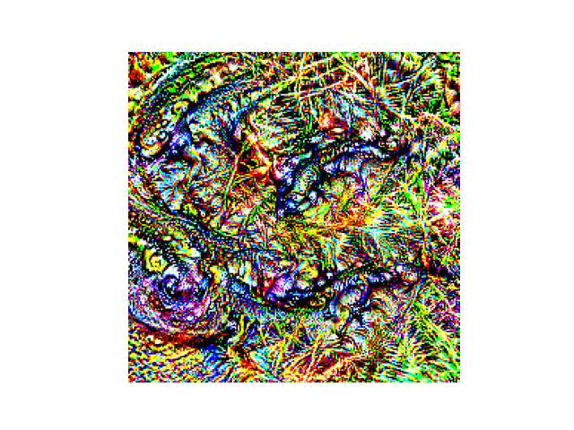
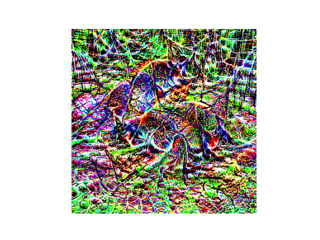
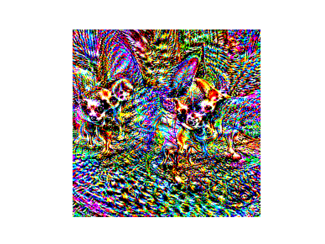
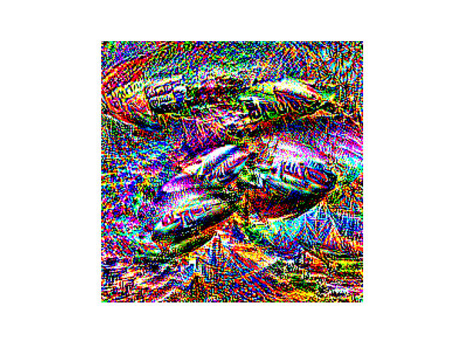

# optimFV
A generalised feature visualiser tool that uses activation maximisation to generate visualisations at a particular
layer and channel index. It currently supports the following:
 - Datasets: MNIST, CIFAR10, CIFAR100, ImageNet-1K
 - Models: MLP, 3C3L, ResNet-18 (see `models`)
 - Optimisers: SGD (optionally with momentum), Adam, AdaGrad, L-BFGS, Curveball (see `optimisers`)

This was created to see the effect of different optimisers on model features. 
For more information, see https://pranav-bluedot-blog.notion.site/ .

## Usage
 - To visualise: run `python scripts/visualise.py --config <path_to_config>` or `python scripts/visualise.py <args>`. If you want to see the optimisation interactively, use `-i` (interactive mode), which allows you to see the model layers, trainable parameters, and select the layer and the channel index.
 - To train: run `python scripts/train.py --config <path_to_config>` or `python scripts/train.py <args>`. Make sure to define your own models in `models` or optimisers in `optimisers` beforehand if you want to use them.

For example configs, see `configs`.

## Examples
The following are feature visualisations from a pre-trained ResNet-18 on ImageNet-1K, with 1000 optimisations steps using Adam.
| Spotted Salamander | Wallaby | Chihuahua | Airship |
|:-------:|:-------:|:-------:|:-------:|
|  |  |  | |

### To-Do
 - [ ] Add `poetry.lock` file for easy installation